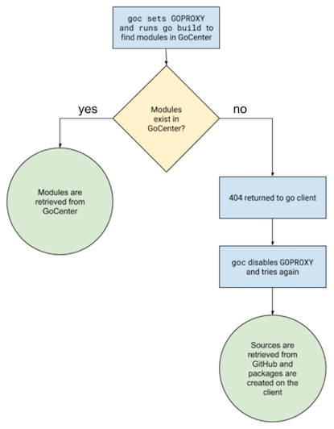

# Introduction
The ```goc``` utility is a wrapper for the go client that correctly builds Go applications using packages from [GoCenter](https://gocenter.jfrog.com/stats) without the need for manual setup.

# Usage
Invoke ```goc``` from the command line as you would run any operation in the go client.

## Examples:
```
goc build
goc get
```

# How it Works
The ```goc``` utility automatically assigns *GOPROXY* to [GoCenter](https://gocenter.jfrog.com/stats), so that Go dependencies will be primarily resolved from that repository. Unlike the ```go``` client alone, however, any packages not found in [GoCenter](https://gocenter.jfrog.com/stats) will be resolved by ```goc``` from the source control. This is the default action until [GoCenter](https://gocenter.jfrog.com/stats) grows to serve all the dependencies.


# Download and Installation
You can download ```goc``` as follows.
## Curl Command
```
curl -fL https://getgoc.gocenter.io | sh
```
## Directly from Bintray
Download the executable from [Bintray](https://bintray.com/jfrog/goc).

## Homebrew
Homebrew formula and other platform-specific installers are coming soon!

# Building the Executable
```goc``` is written in the Go programming language, so to build ```goc``` yourself, you must have Go installed and configured on your workstation.

## Install Go
To download and install Go, please refer to the [Go documentation](https://golang.org/doc/install). ```goc``` requires Go 1.11 or later.

## Download and build goc
1. Navigate to a directory where you want to store the ```goc``` project. Make sure that this directory is outside the *$GOPATH* directory tree.
2. Verify that the *GO111MODULE* environment variable is either unset, or explicitly set to *auto*.
3. Clone the goc project by executing the following command:
```git clone https://github.com/jfrog/goc/```
4. Build the project by navigating to the goc directory and executing the go build command as shown below. Once completed, you will find the goc executable at your current directory.
```
cd goc
go build
```

# FAQ
Q. I already have JFrog Artifactory set up to proxy GoCenter and GitHub within a virtual repository. What client should I use to build my Go project?

A. ```goc``` only supports proxying modules from GoCenter. Use the [JFrog CLI](https://github.com/jfrog/jfrog-cli-go) to build your Go projects when using Artifactory, with GoCenter set up as a remote repository. [JFrog CLI](https://github.com/jfrog/jfrog-cli-go) provides a simple interface for a variety of functions with Artifactory. To learn how to use JFrog CLI, please visit the [JFrog CLI User Guide](https://www.jfrog.com/confluence/display/CLI/JFrog+CLI).

Q. Doesn't using ```goc``` defeat some purposes of an immutable builds? For example, one can't be sure which dependencies are trustworthy (immutable, cached in GoCenter) and which are still volatile (coming from GitHub, for example).

A. We recommend you use ```goc``` for development, until GoCenter includes all the dependencies you will ever need. For production builds you should lock down the resolution of dependencies and also use a local repository to host and cache your modules. 

# Troubleshooting & Issues
## Communicating with us

The best way to communicate with us is to open an issue on this repository. This is the correct channel for any issues you experience while using ```goc```, or any improvements you wish to discuss.
* When opening an issue, please make clear if it is a bug/problem you are experiencing or a request for a new feature or improvement
* If you are submitting a bug report, please provide detailed steps to reproduce your issue. This should include the name and URL of the Go project, and the version that you were trying to build if relevant.
* To open an issue click *Issues* above and please review the list of open issues.